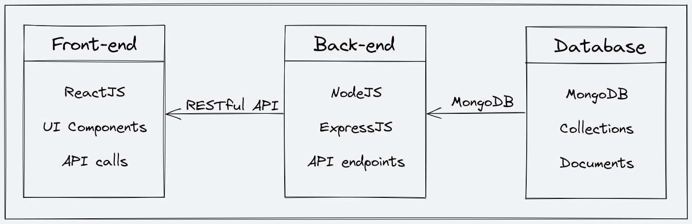
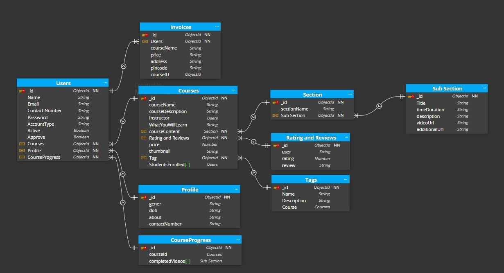

<div align="center">

# 📚 HelloWorld — EdTech Learning Platform

**A full-stack MERN EdTech platform where students learn, instructors create and sell courses, and AI helps students understand video lectures faster.**

[](https://react.dev/)
[](https://nodejs.org/)
[](https://www.mongodb.com/)
[](https://redux-toolkit.js.org/)
[](https://tailwindcss.com/)
[](https://razorpay.com/)
[](https://ai.google.dev/)

</div>


---

## 📌 Project Overview

**HelloWorld** is a full-stack online learning platform built with the MERN stack.

The platform provides separate experiences for:

- **Students** — browse courses, purchase courses, watch lectures, track progress, rate courses, manage profiles, and generate AI-powered lecture summaries.
- **Instructors** — create and manage courses, organize sections and video lectures, upload media, and view enrollment/revenue analytics.
- **Admins** — manage course categories.

The application combines a React frontend, Express/Node.js backend, MongoDB database, Cloudinary media storage, Razorpay payments, email services, JWT authentication, and Google Gemini-based video summarization.

---

## ✨ Key Features

### 🔐 Authentication & Account Management

- User signup and login
- OTP-based email verification
- JWT-based authentication
- Student, Instructor, and Admin roles
- Protected frontend and backend routes
- Forgot-password and password-reset flow
- Change password
- Profile editing
- Profile picture upload
- Account deletion
- Email notifications through Nodemailer

### 👨‍🎓 Student Features

- Browse the course catalog
- Browse courses by category
- View detailed course information
- Add courses to cart
- Purchase courses using Razorpay
- Receive payment/enrollment emails
- View enrolled courses
- Watch course lectures
- Navigate between lectures
- Mark lectures as completed
- Track course progress
- Submit ratings and reviews
- Manage profile and account settings

### 🤖 AI Video Learning Assistant

The latest version adds an **AI Video Summary** feature powered by **Google Gemini**.

From an enrolled course lecture, a student can request an AI-generated study note.

The backend:

1. Verifies that the student is enrolled in the course.
2. Retrieves the selected lecture and its video URL.
3. Downloads the lecture video temporarily.
4. Uploads the video to Gemini.
5. Waits for Gemini to process the video.
6. Sends the video to the Gemini model with a study-note prompt.
7. Returns the generated Markdown study notes to the frontend.
8. Deletes the temporary Gemini file and local temporary video data.

The generated study notes are designed to include:

- Overview
- Concepts covered
- Definitions
- Detailed explanations
- Examples and demonstrations
- Key points
- Common confusions
- Practical understanding
- Final takeaways
- Useful timestamps when reliably available

The frontend displays the generated notes in an **AI Summary panel** next to the lecture video and supports regeneration.

> **AI video summarization requires a valid Gemini API key and a Node.js version that supports the server's built-in `fetch` and `Readable.fromWeb` APIs. Node.js 18+ is recommended for the current AI implementation.**

### 👨‍🏫 Instructor Features

- Instructor dashboard
- Course creation wizard
- Course information management
- Course categories and tags
- Learning objectives and requirements
- Course thumbnail upload
- Section creation
- Subsection/lecture creation
- Video lecture upload
- Course editing
- Section and subsection editing/deletion
- Course deletion
- Instructor course listing
- Enrollment statistics
- Revenue statistics
- Chart-based instructor analytics

### 🛡️ Admin Features

- Create course categories
- View/manage categories
- Admin-protected category creation

### 🌐 Public Features

- Responsive home page
- Course catalog
- Category-based browsing
- Course details
- About page
- Contact page
- Instructor call-to-action sections
- Responsive desktop/tablet/mobile UI
- Styled email templates

---

## 🏗️ System Architecture

<div align="center">
  
</div>

The application follows a three-tier architecture:

```text
┌───────────────────────────────────────────────┐
│              React Frontend                   │
│  UI • Routing • Redux • API Calls • Forms    │
└───────────────────────┬───────────────────────┘
                        │ REST APIs / Axios
                        ▼
┌───────────────────────────────────────────────┐
│          Node.js + Express Backend            │
│ Auth • Courses • Payments • AI • Profiles    │
└───────────────┬───────────────┬───────────────┘
                │               │
                ▼               ▼
        ┌──────────────┐   ┌──────────────────┐
        │   MongoDB    │   │ External Services│
        │  + Mongoose  │   │ Cloudinary       │
        └──────────────┘   │ Razorpay         │
                           │ Nodemailer       │
                           │ Google Gemini    │
                           └──────────────────┘
```

### Frontend

React handles:

- User interface
- Client-side routing
- Course browsing
- Authentication screens
- Dashboards
- Video learning interface
- AI summary panel
- Redux global state
- API communication

### Backend

Express/Node.js handles:

- REST API endpoints
- Authentication
- Authorization
- Course management
- Student progress
- Payments
- Reviews
- Profile management
- Email delivery
- AI video summarization
- Integration with external services

### Database

MongoDB with Mongoose stores:

- Users
- Profiles
- Courses
- Sections
- Subsections
- Course progress
- Ratings/reviews
- Categories
- OTP records
- Invoices

---

## 🗄️ Database Structure

<div align="center">
  
</div>

| Collection | Purpose |
|---|---|
| **User** | Student, instructor, and admin accounts |
| **Profile** | Extended user profile information |
| **Course** | Course metadata, instructor, pricing, enrollment |
| **Section** | Course-level content sections |
| **SubSection** | Individual video lectures |
| **CourseProgress** | Student lecture completion/progress |
| **RatingAndReviews** | Course ratings and reviews |
| **Category** | Course categories |
| **OTP** | Temporary email verification OTP records |

---

## 🛠️ Technology Stack

### Frontend

| Technology | Usage |
|---|---|
| React 18 | Frontend UI |
| React Router | Client-side routing |
| Redux Toolkit | Global state management |
| Axios | HTTP/API communication |
| Tailwind CSS | Styling and responsive UI |
| React Hook Form | Form handling |
| React Hot Toast | Notifications |
| React Icons | UI icons |
| Swiper | Sliders/carousels |
| Video React | Video player |
| Chart.js + react-chartjs-2 | Instructor analytics |
| React Dropzone | File uploads |
| React Markdown | Rendering AI-generated study notes |
| React Type Animation | Animated text |
| Showdown | Markdown/HTML conversion support |

### Backend

| Technology | Usage |
|---|---|
| Node.js | Server runtime |
| Express.js | REST API framework |
| MongoDB + Mongoose | Database and ODM |
| JWT | Authentication |
| bcrypt / bcryptjs | Password hashing |
| Nodemailer | Email delivery |
| OTP Generator | OTP generation |
| Razorpay | Payment processing |
| Cloudinary | Image/video storage |
| Express File Upload | File handling |
| Dotenv | Environment configuration |
| Nodemon | Development server |
| Google GenAI SDK | Gemini AI integration |

---

## 🔌 Major API Areas

The backend API is organized under:

```text
/api/v1
```

### Authentication

```text
POST /auth/signup
POST /auth/login
POST /auth/sendotp
POST /auth/changepassword
POST /auth/reset-password-token
POST /auth/reset-password
```

### Courses

```text
GET  /course/getAllCourses
POST /course/getCourseDetails
POST /course/getFullCourseDetails
POST /course/createCourse
POST /course/editCourse
POST /course/addSection
POST /course/updateSection
POST /course/deleteSection
POST /course/addSubSection
POST /course/updateSubSection
POST /course/deleteSubSection
GET  /course/getInstructorCourses
DELETE /course/deleteCourse
POST /course/updateCourseProgress
```

### Categories

```text
GET  /course/showAllCategories
POST /course/createCategory
POST /course/getCategoryPageDetails
```

### Ratings & Reviews

```text
POST /course/createRating
GET  /course/getAverageRating
GET  /course/getReviews
```

### Payments

```text
POST /payment/capturePayment
POST /payment/verifyPayment
POST /payment/sendPaymentSuccessEmail
```

### Profiles

```text
GET /profile/getUserDetails
GET /profile/getEnrolledCourses
GET /profile/instructorDashboard
PUT /profile/updateProfile
```

### Contact

```text
POST /reach/contact
```

### AI

```text
POST /ai/summarize-video
```

The AI endpoint is protected by authentication and student authorization.

---

## 📂 Project Structure

```text
HelloWorld/
│
├── public/
│   ├── favicon.png
│   ├── logo.png
│   ├── logo192.png
│   ├── logo512.png
│   └── ...
│
├── Images/
│   ├── architecture.png
│   ├── homepage.png
│   └── schema.jpg
│
├── src/
│   ├── assets/
│   │   ├── Images/
│   │   ├── Logo/
│   │   └── TimeLineLogo/
│   │
│   ├── components/
│   │   ├── Common/
│   │   └── core/
│   │       ├── AboutPage/
│   │       ├── Auth/
│   │       ├── Catalog/
│   │       ├── ContactUsPage/
│   │       ├── Course/
│   │       ├── Dashboard/
│   │       ├── HomePage/
│   │       └── ViewCourse/
│   │
│   ├── data/
│   ├── hooks/
│   ├── pages/
│   ├── reducer/
│   ├── services/
│   │   └── operations/
│   ├── slices/
│   ├── utils/
│   ├── App.jsx
│   ├── App.css
│   └── index.js
│
├── server/
│   ├── config/
│   ├── controllers/
│   │   ├── AI.js
│   │   ├── Auth.js
│   │   ├── Category.js
│   │   ├── ContactUs.js
│   │   ├── Course.js
│   │   ├── courseProgress.js
│   │   ├── payments.js
│   │   ├── profile.js
│   │   ├── RatingandReview.js
│   │   ├── resetPassword.js
│   │   ├── Section.js
│   │   └── Subsection.js
│   ├── mail/
│   │   └── templates/
│   ├── middleware/
│   ├── models/
│   ├── routes/
│   │   ├── AI.js
│   │   ├── Contact.js
│   │   ├── Course.js
│   │   ├── Payments.js
│   │   ├── profile.js
│   │   └── user.js
│   ├── utils/
│   └── index.js
│
├── package.json
├── tailwind.config.js
├── prettier.config.js
└── README.md
```

---

# 🚀 Installation & Setup

## Prerequisites

Install the following:

- Node.js 18 or above recommended for the current AI backend implementation
- npm
- Git
- MongoDB / MongoDB Atlas
- Cloudinary account
- Razorpay account
- Gmail/SMTP credentials if email functionality is required
- Google Gemini API key for AI video summaries

> The repository currently contains an `.nvmrc` specifying Node `v16.18.0`, while the current AI implementation uses Node APIs available in Node 18+. Use Node 18+ for the complete current feature set.

---

## 1. Clone the Repository

```bash
git clone https://github.com/mulikshivam02/HelloWorld---MERN.git
cd HelloWorld
```

---

## 2. Install Frontend Dependencies

From the project root:

```bash
npm install
```

---

## 3. Install Backend Dependencies

```bash
cd server
npm install
cd ..
```

---

## 4. Configure Environment Variables

### Frontend

Create a `.env` file in the project root:

```env
REACT_APP_BASE_URL=http://localhost:4000/api/v1
```

### Backend

Create:

```text
server/.env
```

Add the required configuration:

```env
# MongoDB
MONGODB_URL=your_mongodb_connection_string

# JWT
JWT_SECRET=your_jwt_secret

# Cloudinary
CLOUD_NAME=your_cloudinary_cloud_name
API_KEY=your_cloudinary_api_key
API_SECRET=your_cloudinary_api_secret
FOLDER_NAME=HelloWorld

# Razorpay
RAZORPAY_KEY=your_razorpay_key
RAZORPAY_SECRET=your_razorpay_secret

# Mail
MAIL_HOST=smtp.gmail.com
MAIL_USER=your_email@gmail.com
MAIL_PASS=your_gmail_app_password

# Server
PORT=4000

# Google Gemini
GEMINI_API_KEY=your_gemini_api_key
GEMINI_MODEL=gemini-2.5-flash-lite
```

### Environment Variable Security

**Never commit real API keys, passwords, database credentials, or `.env` files to GitHub.**

The project `.gitignore` is configured to ignore environment files.

---

# ▶️ Running the Application

## Option 1 — Run Frontend and Backend Together

From the root directory:

```bash
npm run dev
```

This starts:

```text
Frontend → http://localhost:3000
Backend  → http://localhost:4000
```

---

## Option 2 — Run Separately

### Terminal 1 — Backend

```bash
cd server
npm run dev
```

### Terminal 2 — Frontend

```bash
npm start
```

---

# 🤖 How AI Video Summary Works

When an enrolled student clicks **Generate Summary** on a lecture:

```text
Student
   │
   ▼
React Video Player
   │
   │ POST /api/v1/ai/summarize-video
   ▼
Express AI Route
   │
   ├── Verify JWT
   ├── Verify Student Role
   ├── Verify Course Enrollment
   └── Find Lecture Video
            │
            ▼
      Download Video
            │
            ▼
       Upload to Gemini
            │
            ▼
     Gemini Processes Video
            │
            ▼
      Generate Study Notes
            │
            ▼
       Return Markdown
            │
            ▼
     React AI Summary Panel
```

The AI prompt instructs Gemini to use the actual video as the primary source and produce structured study notes instead of relying only on the lecture title or description.

Temporary video files and uploaded Gemini files are cleaned up after processing.

---

# 💳 Payment Flow

Course purchases use Razorpay.

```text
Student
   │
   ▼
Add Course to Cart
   │
   ▼
Checkout
   │
   ▼
Create Razorpay Order
   │
   ▼
Razorpay Payment
   │
   ▼
Verify Payment
   │
   ▼
Enroll Student
   │
   ▼
Send Confirmation Email
```

---

# ☁️ Media Upload Flow

Course thumbnails, profile images, and lecture videos use Cloudinary-based media handling.

```text
React Frontend
      │
      ▼
Express Backend
      │
      ▼
File Upload Handling
      │
      ▼
Cloudinary
      │
      ▼
Stored Media URL
      │
      ▼
MongoDB Course/Profile Data
```

---

# 📊 Instructor Analytics

The instructor dashboard provides information such as:

- Total courses
- Total students/enrollments
- Course-level revenue
- Revenue visualization
- Course listing and management

Chart.js and `react-chartjs-2` are used for the dashboard charts.

---

# 🔒 Security & Authorization

The application uses multiple layers of access control:

### JWT Authentication

Protected API routes require a valid authentication token.

### Role-Based Authorization

Backend middleware separates:

```text
Student
Instructor
Admin
```

For example:

```text
Student      → enrolled learning features
Instructor   → course creation/management
Admin        → category management
```

The AI video summary endpoint additionally verifies that the authenticated student is enrolled in the requested course.

---

# 🧪 Development

Useful commands:

### Frontend

```bash
npm start
```

### Backend

```bash
cd server
npm run dev
```

### Production Build

```bash
npm run build
```

### Run Tests

```bash
npm test
```

### Format / Development Utilities

The project includes Prettier and Tailwind CSS configuration.

---

# 🗺️ Future Improvements

Potential future enhancements include:

- Personalized learning paths
- ML-based course recommendations
- Mobile application using React Native
- Gamification
- Discussion forums and social learning
- Live classes
- Quizzes and assignments
- Certificate generation
- Multilingual support
- Dark/light theme
- Advanced admin analytics
- Persistent AI-generated summaries
- AI-powered learning assistance beyond video summarization

---

# 🤝 Contributing

Contributions are welcome.

```bash
git checkout -b feature/my-feature
git add .
git commit -m "Add my feature"
git push origin feature/my-feature
```

Then open a Pull Request.

---

# 📄 License

This project uses the **ISC License**.

---

<div align="center">

### Built with ❤️ using the MERN Stack

**HelloWorld — Learn. Teach. Build.**

</div>
